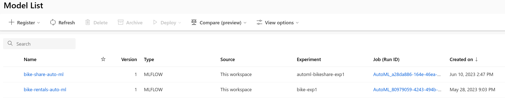
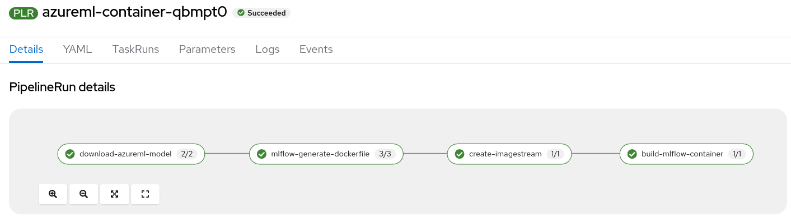
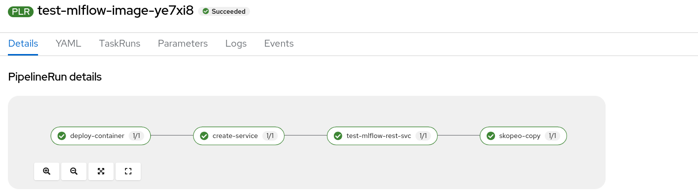
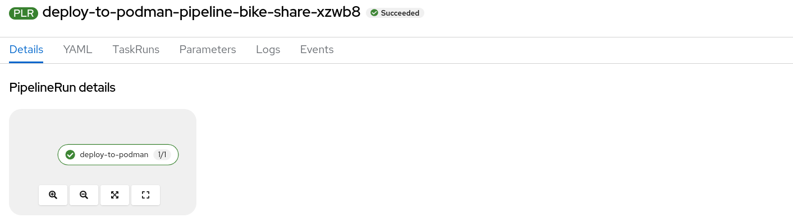

# azureml-model-to-edge
An experiment to deploy Azure ML models to RHDE for serving

## Approach

### Experiment 1

**Model training with Azure Automated ML**

- Train models in the Azure Machine Learning studio with Automated ML
- Register the model in the workbench

**Pipeline azureml-container:**

- Download the model and conda environment
- Generated and patch the Dockerfile
- Create an imagestream
- Build the mlflow container

**Pipeline test-mlflow-image:**

- Deploy the container on OpenShift for local testing
- Create a services
- Test the MLflow REST Service
- Upload to quat.io

**Pipeline deploy-to-podman:**

- Deploy the container to the target RHDE system with Ansible
- Prints out information about the containers (podman ps)


### Experiment 2
- TBD: Similar to experiment 1 but create a ostree image with the model and model serving

### Experiment 3
- TBD: Similar to experiment 1 but deploy to MicroShift with Azure Arc


## Prerequisites
- Trained AzureML model including Mlflow environment
- OpenShift Pipelines Operator install
- A RHEL for Edge system available and podman install
  - podman installed
  - Centos and Centos Stream is fine too
- A repository on quay.io
- A clone on this repo
- OpenShift project / namespace. E.g.  `oc new-project azureml-model-to-edge`

## Review the trained AzureML model

TBD. See also [Tutorial: Forecast demand with no-code automated machine learning in the Azure Machine Learning studio](https://learn.microsoft.com/en-us/azure/machine-learning/tutorial-automated-ml-forecast?view=azureml-api-2)


## Build required container images for pipeline tasks

```
cd tekton

oc apply -f ansible-image/ansible-image-bc.yaml -f azure-python-image/azure-python-bc.yaml -f mlflow-image/mlflow-bc.yaml

```

Wait until the 3 container are built.

## Deploy AzureML Container build pipeline


### First, create a secret with the Azure credentials

Create an `.azure-env` file. E.g.:

```
RESOURCEGROUP=<resourcegroup>
WORKSPACE=<workspace>
SUBSCRIPTION=<subscription>
AZURE_TENANT_ID=<azure_tenant_id>
AZURE_CLIENT_ID=<azure_client_id>
AZURE_CLIENT_SECRET=<azure_client_secret>
```

Create the secret:
```
oc create secret generic azure-env --from-env-file=.azure-env
``` 


### Add required tasks (pls skip - pipeline use preinstalled ClusterTasks):
```
oc apply -f https://raw.githubusercontent.com/tektoncd/catalog/main/task/git-clone/0.9/git-clone.yaml
oc apply -f https://api.hub.tekton.dev/v1/resource/tekton/task/buildah/0.1/raw
oc apply -f https://raw.githubusercontent.com/tektoncd/catalog/main/task/openshift-client/0.2/openshift-client.yaml
```

### Deploy and run the pipeline
```
oc apply -k azureml-container-pipeline/
oc create  -f azureml-container-pipeline/azureml-container-pipelinerun.yaml 
```

## Deploy Test MlFlow Container image pipeline

##  Quay Repository and Robot Permissions
- Create a repository (bike-rentals-auto-ml), add a robot account to push images and set write Permissions for the robot on the repository.
- Download `build-secret.yml`
- Apply build-secret. E.g.:

```
oc apply -f <downloaddir>/manuela-build-secret.yml 
oc secret link pipeline manuela-build-pull-secret
```

### Add required tasks: (pls skip - pipeline use preinstalled ClusterTasks)
```
kubectl apply -f https://raw.githubusercontent.com/tektoncd/catalog/main/task/skopeo-copy/0.2/skopeo-copy.yaml
```

### Deploy and run the pipeline
```
oc apply -k test-mlflow-image-pipeline/
oc create -f test-mlflow-image-pipeline/test-mlflow-image-pipelinerun.yaml
```


## Deploy Azure ML container to target system

### Prep

- Create new ssh key for Ansible with `ssh-keygen -f  ansible`
- Create a secret:
```
oc create secret generic ansible-ssh-key --from-file=ssh-key=<workdir>/ansible-key
```
- Add the public key to the allowed key:
```
ssh-copy-id -i <workdir>/ansible-key.pub <youruser>@<target-system>

```
### Deploy and run the pipeline
```
oc apply -k oc apply -k deploy-to-podman-pipeline/
```

Edit `deploy-to-podman-pipeline/deploy-to-podman-pipelinerun.yaml` and update the values of `target-system`  and `target-system-user`.

Run the pipeline:
```
oc create -f deploy-to-podman-pipeline/deploy-to-podman-pipelinerun.yaml
```
